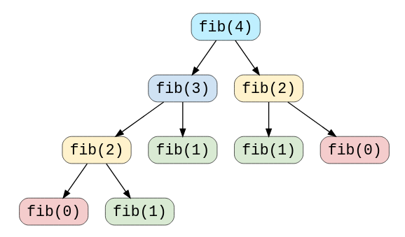

# 7. Dynamic Programming

## What is Dynamic Programming?





### Breaking down a problem

Dynamic Programming \(DP\) is an algorithmic technique for solving an optimization problem by breaking it down into simpler subproblems, and making use of the fact that an optimal solution to the main problem would involve optimal solutions to subproblems.

The classic example would be the generation of Fibonnaci numbers. The Fibonnaci numbers are defined in a recursive way, where

$$
F(0) = 0, F(1) = 1, \text{ and } \newline 
F(n) = F(n-1) + F(n-2), n \geq 0.
$$

Thus, it is natural for us to want to code it up in a recursive way. An example of this would be

```python
def Fib_recursive(n):
    if n == 0:
        return 0
    if n == 1:
        return 1
    else:
        return Fib_recursive(n-1) + Fib_recursive(n-2)
```

### Characteristic of a DP Problem

There are a few characteristics of a problem that indicates to us that we could use DP to optimize the performance. 

#### 1. Overlapping Subproblems

Any algorithm which solves the same subproblem multiple time is doing redundant work. For the Fibonacci example, take a look at the subproblem tree:



#### 2. Optimal Substructure Property

Any problem has an optimal substructure property if its overall solution can be constructed from optimal solutions of its subproblems. For the case of the Fibonacci, since a problem of size `n` can be broken down into smaller problems of size `n-1` and `n-2`, then the optimal solution to the subproblems will provide the optimal solution to the main problem.

### Dynamic Programming Models

DP offers 2 main methods for solving problems

#### 1. Top-Down with Memoization

In this method, we begin at the big problem, and recursively find solutions to smaller subproblems. Once we have found the solution to a subproblem, we cache it, so we don't need to solve it again. This technique of storing already solved problems is called **Memoization**.

An example of a DP solution to the Fibonacci problem with Memoization is

```python
def calculateFib(n):
    memoize = [-1 for x in range(n+1)]
    return calculateFibRecur(memoize, n)

def calculateFibRecur(memoize, n):
    if n < 2:
        return n
    # If we have already solved the problem, return the value
    if memoize[n] >= 0:
        return memoize[n]
    
    memoize[n] = calculateFibRecur(memoize, n-1) +
                 calculateFibRecur(memoize, n-2)
    return memoize[n]
```

#### 2. Bottom-Up with Tabulation

Tabulation is the opposite of the top-down approach and avoids recursion. In this approach, we solve this problem from the bottom up \(by solving all related sub-problems first\). This is typically done by filling up an n-dimensional table. Based on the table, the main problem is then solved.

An example of a DP solution to the Fibonacci problem with Tabulation is:

```python
def calculateFib(n):
    tab = [0,1]
    for i in range(2, n+1):
        tab.append(tan[i-1] + tab[i-2])
    return tab[n]
```

### Differences between Tabulation and Memoization

|  | Tabulation | Memoization |
| :--- | :--- | :--- |
| State | State transition relation is difficult to think | State transition relation is easy to think |
| Code | Code gets complicated when lot of conditions are required | Code is relatively easy and less complicated |
| Speed | Fast, as we directly access previous states from the table | Slow due to loads of recursive calls and return statements |
| Subproblem Solving | If all subproblems need to be solved at least once, then a bottom-up approach usually outperforms a top-down approach by a constant factor | If some subproblems do not need to be solved at all, then Memoization has the advantage that it can completely skip these subproblems |
| Table Entries | Starting from the first entry, all entries are filled up one by one | All entries of the look-up table are not necessarily filled. Table is filled on demand. |

## Memoization in Python

### Built-in Solution

```python
import functools
@functools.lru_cache()
def fn_to_memoize(n):
    pass
```

### From Scratch

A simple `memoize` from scratch, with unbounded storage

* Always use the built-in cache, it is faster and has more options
* Unbounded storage may not be good

```python
def memoize(func):
    cache = dict()
    @functools.wraps(func)
    def memoized_func(*args):
        if args in cache:
            return cache[args]
        result = func(*args)
        cache[args] = result
        return result
    return memoized_func
```

## DP Strategies



For most DP problems, the strategy would be to go in this order:

1. Find recursive relation
2. Recursive \(top-down\)
3. Recursive + memo \(top-down\)
4. Iterative + memo \(bottom-up\)
5. Iterative + N variables \(bottom-up\)

| Strategy | Time Complexity | Space Complexity |
| :--- | :--- | :--- |
| Recursive | Depending on problem, but often bad.  | O\(N\) - Recursion stack |
| Recursive + memo | O\(N\) | O\(N\) - Memo + Recursion Stack |
| Iterative + memo | O\(N\) | O\(N\) - Memo |
| Iterative + N vars | O\(N\) | O\(1\) |

## 7 Steps to Solving any DP Interview Problem



1. **Identify the DP -** Is this problem solvable by solving its subproblems?
2. **Identify the problem variables -** Which parameters are changing, and which are static?
3. **Express the recurrence relation**
   1. How can the solutions to the subproblems be combined to solve the main problem
4. **Identify the base cases**
   1. Which cases have obvious solutions?
   2. What are the illegal values for parameters?
   3. What conditions can we use to find these base cases?
   4. Do we need to worry about 'jumping past' the base cases with illegal values?
5. **Decide: Iterative or Recursive**
   1. Big O time complexity is the same.
   2. Usually recursive easier to reason, iterative would require more work to figure out which values we need and the order for computation.
   3. Recursive potentially faster depending on the input.
   4. Watch out for stack limit for recursion.
6. **Add Memoization**
7. **Determine Time Complexity**
   1. Think of each state
   2. Think of work done per state

|  | Recursive | Iterative |
| :--- | :--- | :--- |
| **Asymptotic Time Complexity** | Same assuming memoization | Same |
| **Memory usage** | Recursive stack, Sparse memoization | Full memoization |
| **Execution speed** | Often faster, depending on input | Slower, needs to do same work regardless of input |
| **Stack overflow** | A problem | No issues as long as enough memory for full memoization |
| **More intuitive / easier to implement** | Often easier to reason about | Most people find it hard to reason through |


